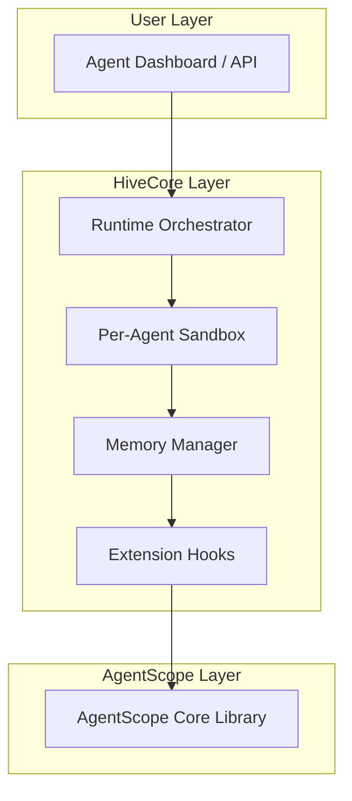

# 🐝 HiveCore

> **Extending the AgentScope ecosystem — A modular core framework designed to fill the missing runtime, orchestration, and memory layers of AS (AgentScope).**


---

## 🌐 Overview

**HiveCore** is an open-source extension framework for **AgentScope (AS)** — aiming to **complete** the AS ecosystem with enhanced runtime management, sandbox orchestration, and memory coordination.

It provides a unified infrastructure to run, observe, and extend AS Agents dynamically.  
The name “HiveCore” reflects its design principle: *many agents, one hive — a collective intelligence system.*

---

## 🚀 Vision

> *From isolated Agents to orchestrated intelligence.*

While AgentScope provides a foundation for agent definitions and communication, **HiveCore** focuses on what’s missing in AS:
- 🧩 **Dynamic Runtime Management** — isolated sandbox per Agent  
- 🔄 **Multi-Agent Orchestration** — role-based coordination and scheduling  
- 🧠 **Memory & Context Persistence** — Memu/Mem0-like hybrid memory layer  
- 🧱 **Extensible Plugin System** — allows community modules to hook into the runtime  

The long-term goal: **make AgentScope a complete, self-evolving agent runtime standard.**

---

## 🧬 Architecture



---

## ⚙️ Core Modules

| Module | Description |
|--------|--------------|
| `hivecore.runtime` | Manages distributed agent execution and lifecycle control. |
| `hivecore.sandbox` | Isolated runtime layer; supports Docker, Fargate, and local sandboxes. |
| `hivecore.memory` | Unified context memory — supports PGVector, Milvus, or in-memory store. |
| `hivecore.plugins` | Register extensions: loggers, schedulers, model routers, etc. |
| `hivecore.api` | REST/WebSocket interface for real-time orchestration and monitoring. |

---

## 🧰 Tech Stack

- **Python 3.10+**
- **FastAPI** — API Layer  
- **SQLAlchemy + PostgreSQL** — Metadata persistence  
- **Docker / Fargate** — Sandbox Runtime  
- **Mem0 / LangChain / Chroma** — Memory layer  
- **AgentScope (AS)** — Base dependency  

---

## 🏗️ Installation

```bash
git clone https://github.com/yourname/hivecore.git
cd hivecore
pip install -e .
```

Or from PyPI (coming soon):

```bash
pip install hivecore
```

---

## ⚡ Quick Start

```python
from hivecore import HiveRuntime
from agentscope import Agent

# Load agents
agents = [Agent("coder"), Agent("reviewer")]

# Create runtime
runtime = HiveRuntime(agents)
runtime.run("Build a weather app using React and Django")
```

---

## 🛣️ Roadmap

| Phase | Focus | Status |
|-------|--------|--------|
| v0.1 | Runtime + Sandbox prototype | ✅ In progress |
| v0.2 | Memory layer integration | ⏳ Planned |
| v0.3 | Plugin + Observer hooks | ⏳ Planned |
| v0.4 | Full AS compatibility | 🔜 |
| v1.0 | Stable release (with community plugins) | 🚀 Future |

---

## 🤝 Contributing

HiveCore welcomes collaboration!  
If you’re extending AgentScope or building runtime tools, feel free to:
1. Fork the repo  
2. Create a new branch (`feature/your-feature`)  
3. Submit a pull request

We encourage clean architecture, strong typing, and minimal coupling.

---

## 📜 License

Released under the **MIT License** — feel free to fork, modify, and integrate.

---

## 🌍 Author & Project Links

**Project Lead:** [Prayer](https://github.com/prayert)  
**Website:** [django.prayert.cn](https://django.prayert.cn)  
**Related Projects:** AgentScope, Memu, Mem0  

---

> “A hive of agents — each autonomous, all aligned.”
