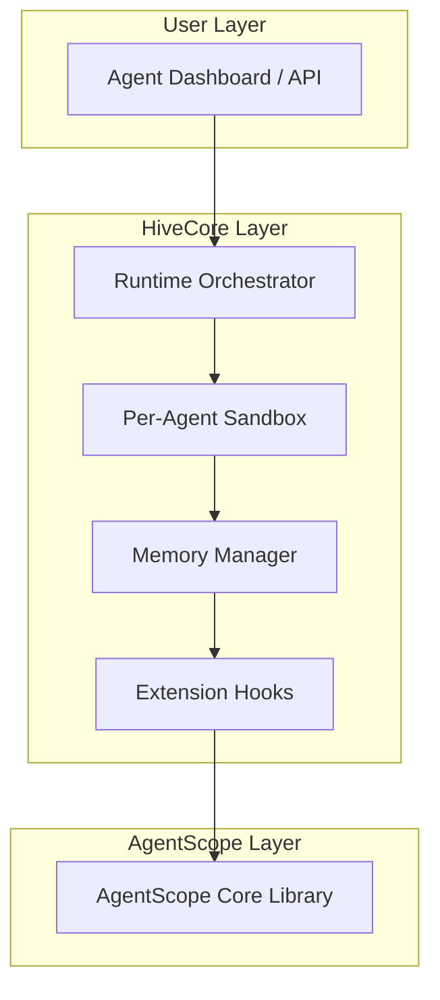

# 🐝 HiveCore

> **扩展 AgentScope 生态——一个用于补齐 AS（AgentScope）在运行时、编排与记忆层缺口的模块化核心框架。**


---

## 🌐 概览

**HiveCore** 是面向 **AgentScope (AS)** 的开源扩展框架，旨在通过强化运行时管理、沙箱编排与记忆协同来补齐 AS 的生态缺失。

它为 AS Agents 提供统一的运行、观测与扩展基础设施。  
名称 “HiveCore” 的含义是：*众多 Agent，共享一座蜂巢——协同进化的群体智能。*

---

## 🚀 愿景

> *让孤立的 Agent 进化为可编排的智能群体。*

AgentScope 已具备 Agent 定义与通信的基础能力，而 **HiveCore** 专注在 AS 仍待完善的能力上：
- 🧩 **动态运行时管理**：为每个 Agent 提供隔离沙箱  
- 🔄 **多 Agent 协同编排**：基于角色的调度与协作  
- 🧠 **记忆与上下文持久化**：借鉴 Memu/Mem0 的混合记忆层  
- 🧱 **可扩展插件系统**：允许社区模块挂载到运行时  

长期目标：**让 AgentScope 演进为完整、自我迭代的 Agent 运行时标准。**

---

## 🧬 架构



---

## ⚙️ 核心模块

| 模块 | 说明 |
|------|------|
| `hivecore.runtime` | 管理分布式 Agent 的执行与生命周期。 |
| `hivecore.sandbox` | 提供隔离运行层，支持 Docker、Fargate 与本地沙箱。 |
| `hivecore.memory` | 统一上下文记忆，兼容 PGVector、Milvus 或内存存储。 |
| `hivecore.plugins` | 注册扩展：日志、调度器、模型路由器等。 |
| `hivecore.api` | 通过 REST/WebSocket 暴露实时编排与监控接口。 |

---

## 🧰 技术栈

- **Python 3.10+**
- **FastAPI** —— API 层  
- **SQLAlchemy + PostgreSQL** —— 元数据持久化  
- **Docker / Fargate** —— 沙箱运行时  
- **Mem0 / LangChain / Chroma** —— 记忆层  
- **AgentScope (AS)** —— 基础依赖  

---

## 🏗️ 安装

```bash
git clone https://github.com/yourname/hivecore.git
cd hivecore
pip install -e .
```

或即将上线的 PyPI：

```bash
pip install hivecore
```

---

## ⚡ 快速开始

```python
from hivecore import HiveRuntime
from agentscope import Agent

# 加载 Agents
agents = [Agent("coder"), Agent("reviewer")]

# 创建运行时
runtime = HiveRuntime(agents)
runtime.run("Build a weather app using React and Django")
```

---

## 🛣️ 路线图

| 版本 | 关注点 | 状态 |
|------|--------|------|
| v0.1 | 运行时 + 沙箱原型 | ✅ 进行中 |
| v0.2 | 记忆层集成 | ⏳ 规划中 |
| v0.3 | 插件 + 观察者钩子 | ⏳ 规划中 |
| v0.4 | 与 AS 全量兼容 | 🔜 |
| v1.0 | 稳定版（含社区插件） | 🚀 未来 |

---

## 🤝 参与共建

HiveCore 欢迎社区贡献！  
如果你正在扩展 AgentScope 或构建运行时工具，建议：
1. Fork 仓库  
2. 创建新分支（`feature/your-feature`）  
3. 提交 Pull Request  

我们提倡清晰的架构、强类型与最小耦合。

---

## 📜 许可协议

以 **MIT License** 发布，欢迎自由地 Fork、修改与集成。

---

## 🌍 作者与链接

**项目负责人：** [Prayer](https://github.com/prayert)  
**网站：** [django.prayert.cn](https://django.prayert.cn)  
**相关项目：** AgentScope、Memu、Mem0  

---

> “群落中的每一位 Agent 都能自治，却共享一致的方向。”
